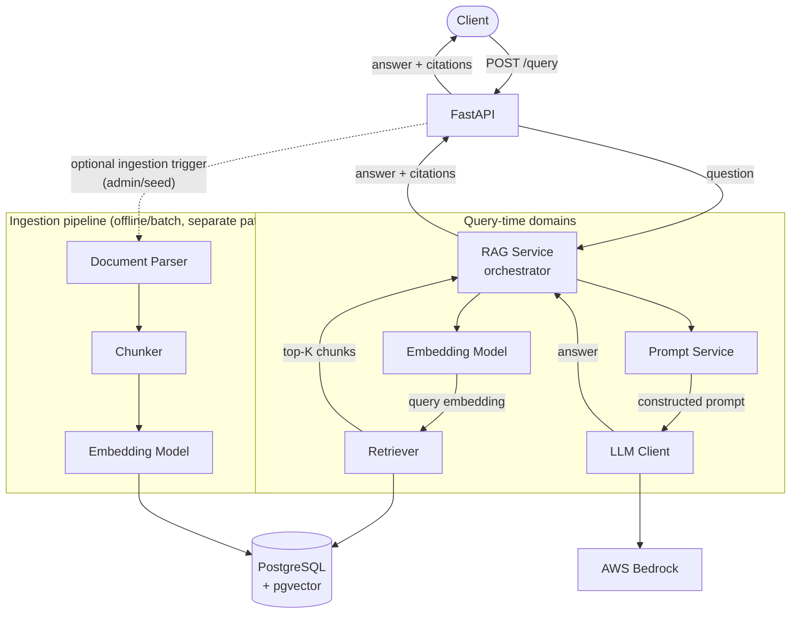
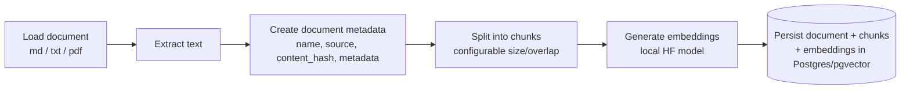
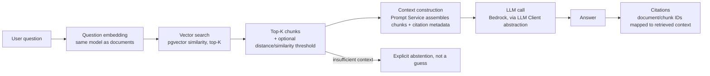
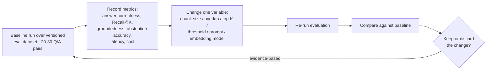

# ARCHITECTURE.md

Proposed system design for the Internal Knowledge Assistant. This is a **proposal pending
developer approval** per the project's "stop and report" requirement - no application code has
been written yet.

## 1. Technology Choices & Tradeoffs

| Concern | Choice | Alternatives considered | Reason |
|---|---|---|---|
| Vector storage | PostgreSQL + pgvector | Pinecone, Qdrant, Weaviate | One datastore for relational metadata + vectors; avoids operating a second system; sufficient for this scale; explicit non-goal to introduce a dedicated vector DB. |
| Embeddings | Local HuggingFace / Sentence Transformers | Bedrock/OpenAI embedding APIs | Educational: understand embedding inference directly instead of treating it as a black box. Zero marginal cost per embed. Must keep query/document embeddings on the same model. |
| LLM | AWS Bedrock, behind an abstraction | Direct OpenAI/Anthropic SDK | Matches target AWS deployment; abstraction keeps the app from being tightly coupled to Bedrock-specific request/response shapes. Single provider - no concrete learning reason yet to support multiple. |
| API framework | FastAPI + Pydantic | Flask, Django | Async-friendly, typed request/response models, fast to iterate. |
| ORM | SQLAlchemy 2.x | raw SQL, Django ORM | Typed models, migrations story, works naturally with pgvector's SQLAlchemy integration. |
| Retrieval | Vector similarity search only | Hybrid (keyword + vector) | Hybrid adds complexity; only add later if evaluation shows a concrete gap. |
| Prompt management | Dedicated `prompts/` module, separate from `llm/` | Inline f-strings in the LLM client, a prompt-management SaaS | Prompt templates are a distinct concern from LLM transport - versioning, variable injection, and safety wrapping (isolating untrusted retrieved text) need their own tested module so prompt changes can be evaluated like any other RAG variable. No external service needed at this scale. |
| Local dev / AWS emulation | [Floci](https://floci.io) (only if/when an AWS integration needs local emulation) | LocalStack | Floci is a free, open-source (MIT), drop-in-compatible local AWS emulator (same port/API surface as LocalStack) with a much lighter footprint. Still only added when a specific AWS integration genuinely needs it - not by default. |
| Observability | Structured logging + LangSmith (free Developer tier) | Custom observability platform, Langfuse | LangSmith's free tier (1 seat, 5,000 traces/month, 14-day retention) comfortably covers a solo learning project with a 20-30 question eval set. If that cap is ever hit, [Langfuse](https://langfuse.com) is a fully open-source, self-hostable free alternative with no trace cap - swap-in candidate behind the same tracing calls. No paid observability tooling required either way. |
| IaC | AWS CDK (Python) | Terraform, CloudFormation | Python-native, matches app language, optional/deferred until local system works. |

## 2. High-Level Architecture

The RAG service is not one monolithic component - each responsibility is its own module/domain
behind a narrow interface (see [`CODING-GUIDELINES.md`](CODING-GUIDELINES.md) for the
`Protocol`-based abstractions): **Parser**, **Chunker**, **Embedding Model**, **Retriever**,
**Prompt Service**, and **LLM Client** are separate, independently testable domains. A thin
**RAG Service** module orchestrates them; it contains no HTTP, SQL, or SDK code itself.



Notes on the diagram:

- Arrows now show the full call/response shape, not just fan-out: the Retriever returns top-K
  chunks to the RAG Service, the LLM Client returns the answer to the RAG Service, which returns
  it to FastAPI and then the client.
- **FastAPI can also trigger ingestion** (dashed edge) through an optional admin/seed endpoint -
  the primary, always-present ingestion path is still the offline `seed`/CLI command (section 17
  of the handoff spec), but nothing stops FastAPI from exposing a thin trigger for it later.
- **Embedding Model** is used by both paths (query-time and ingestion) - it must be the same
  implementation/model for both, so query and document vectors are comparable.
- **Retriever**, **Prompt Service**, and **LLM Client** are each defined as a `Protocol`, so any
  of them can be swapped (different vector store, different prompt template, different model)
  without touching the RAG Service orchestrator.
- Ingestion and query-answering are kept as separate paths: ingestion is a batch/offline concern
  (seed later), query answering is the online request path.

Exact module boundaries may be refined during implementation, but this domain split (parser /
chunker / embeddings / retriever / prompt service / LLM client) is the starting design, not an
open question.

## 3. Core System Flows

### 3.1 Ingestion Flow



Repeatable/idempotent: re-running ingestion on the same content should not duplicate data
(content_hash is the natural dedupe key).

### 3.2 Query Flow (RAG pipeline)



Every stage must be independently inspectable (no single framework call hiding the whole
pipeline) - this is a stated learning objective, not an implementation nicety. Note that context
construction is owned by the **Prompt Service** (template + variable injection + safety wrapping
of untrusted retrieved text), not inlined into the LLM Client.

### 3.3 Evaluation Flow



## 4. Data Model (conceptual, initial)

```
Document
--------
id
name
source
content_hash
metadata
created_at
updated_at

DocumentChunk
-------------
id
document_id (FK -> Document)
chunk_index
content
embedding        (pgvector column; dimension tied to chosen embedding model)
metadata
created_at
```

Exact column types, indexes (e.g. HNSW/IVFFlat on `embedding`), and constraints to be finalized
during the data-model implementation step.

## 5. Configurable Parameters

To support the experimentation goals in the handoff spec, these are first-class config, not
hardcoded:

- Embedding model
- Chunk size / chunk overlap
- Top-K
- Similarity/distance threshold
- Prompt template (versioned - see Prompt Service in section 2)

## 6. API Surface (initial)

```
POST /query
  request:  { "question": "..." }
  response: { "answer": "...", "sources": [...] }
```

Exact response schema (source object shape: document name/id, chunk id, relevant text/location)
finalized during API implementation. A separate ingestion endpoint/command is deferred until the
core query flow is validated (per the "no seeding during planning" rule).

## 7. Observability

Per request, track: request ID, question, retrieved chunk IDs, retrieval latency, model used,
token usage, LLM latency, total latency. Structured logs by default; LangSmith traces where they
add value for LLM/RAG-specific debugging. No custom observability platform.

## 8. Security Considerations (documented risks, not enterprise controls)

- Secrets via environment variables only; nothing committed to Git.
- Prompt injection risk from untrusted/retrieved document content - treat retrieved text as data,
  not instructions, in prompt construction.
- Excessive context injection - bound context size, don't dump entire documents.
- Sensitive data exposure - be mindful of what internal docs get ingested and surfaced via
  citations.

## 9. Cost Considerations

Local Postgres + local HF embedding inference during development; Bedrock calls only for
necessary LLM inference; small eval dataset and small seed documents; no always-on AWS
infrastructure until an optional deployment phase is explicitly greenlit.

## 10. Development Progression

- [ ] 1. Project skeleton
- [ ] 2. PostgreSQL + pgvector (Docker Compose)
- [ ] 3. Document/chunk data model
- [ ] 4. Document parsing & chunking
- [ ] 5. Embeddings
- [ ] 6. Vector retrieval
- [ ] 7. Prompt service (templates, versioning, context assembly, safety wrapping of retrieved text)
- [ ] 8. LLM generation (Bedrock, behind the `LLMClient` abstraction)
- [ ] 9. Citations
- [ ] 10. API
- [ ] 11. Tests (unit + integration)
- [ ] 12. Evaluation dataset
- [ ] 13. Evaluation runner
- [ ] 14. Observability (structured logging + LangSmith)
- [ ] 15. Seed service
- [ ] 16. Optional AWS deployment (CDK; Floci for local AWS emulation if/when needed)

Each step is followed by a Learning Gate (see [`../AGENTS.md`](../AGENTS.md)) before the next one starts.

## 11. Open Decisions (to resolve at the relevant implementation step, not now)

- Specific embedding model + vector dimension.
- Initial chunk size/overlap and the reasoning for it.
- Initial top-K and threshold.
- pgvector index type (HNSW vs IVFFlat) and distance metric (cosine vs L2 vs inner product).
- Prompt template for grounded, citation-aware, abstention-capable answers - and how the Prompt
  Service versions/tracks which template produced a given eval run.
- Evaluation dataset format and scoring method for "answer correctness" and "groundedness".
