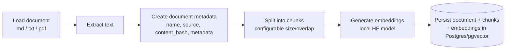
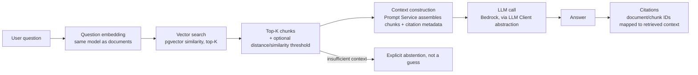
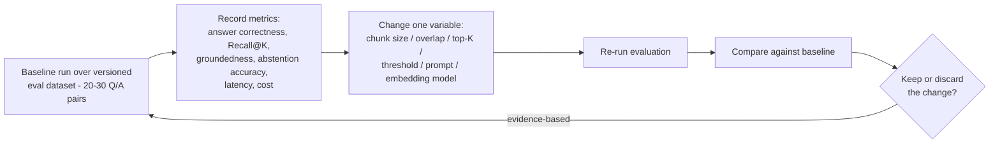

# ARCHITECTURE.md

Proposed system design for the Internal Knowledge Assistant. This is a **proposal pending
developer approval** per the project's "stop and report" requirement - no application code has
been written yet.

## 1. Technology Choices & Tradeoffs

| Concern | Choice | Alternatives considered | Reason |
|---|---|---|---|
| Vector storage | PostgreSQL + pgvector | Pinecone, Qdrant, Weaviate | One datastore for relational metadata + vectors; avoids operating a second system; sufficient for this scale; explicit non-goal to introduce a dedicated vector DB. |
| Embeddings | Local HuggingFace / Sentence Transformers | Bedrock/OpenAI embedding APIs | Educational: understand embedding inference directly instead of treating it as a black box. Zero marginal cost per embed. Must keep query/document embeddings on the same model. |
| LLM | AWS Bedrock, behind an abstraction | Direct OpenAI/Anthropic SDK | Matches target AWS deployment; abstraction keeps the app from being tightly coupled to Bedrock-specific request/response shapes. Single provider - no concrete learning reason yet to support multiple. |
| API framework | FastAPI + Pydantic | Flask, Django | Async-friendly, typed request/response models, fast to iterate. |
| ORM | SQLAlchemy 2.x | raw SQL, Django ORM | Typed models, migrations story, works naturally with pgvector's SQLAlchemy integration. |
| Retrieval | Vector similarity search only | Hybrid (keyword + vector) | Hybrid adds complexity; only add later if evaluation shows a concrete gap. |
| Prompt management | Dedicated `prompts/` module, separate from `llm/` | Inline f-strings in the LLM client, a prompt-management SaaS | Prompt templates are a distinct concern from LLM transport - versioning, variable injection, and safety wrapping (isolating untrusted retrieved text) need their own tested module so prompt changes can be evaluated like any other RAG variable. No external service needed at this scale. |
| Local dev / AWS emulation | [Floci](https://floci.io) (only if/when an AWS integration needs local emulation) | LocalStack | Floci is a free, open-source (MIT), drop-in-compatible local AWS emulator (same port/API surface as LocalStack) with a much lighter footprint. Still only added when a specific AWS integration genuinely needs it - not by default. |
| Observability | Structured logging + LangSmith (free Developer tier) | Custom observability platform, Langfuse | LangSmith's free tier (1 seat, 5,000 traces/month, 14-day retention) comfortably covers a solo learning project with a 20-30 question eval set. If that cap is ever hit, [Langfuse](https://langfuse.com) is a fully open-source, self-hostable free alternative with no trace cap - swap-in candidate behind the same tracing calls. No paid observability tooling required either way. |
| IaC | AWS CDK (Python) | Terraform, CloudFormation | Python-native, matches app language, optional/deferred until local system works. |

## 2. High-Level Architecture

The RAG service is not one monolithic component - each responsibility is its own module/domain
behind a narrow interface (see [`CODING-GUIDELINES.md`](CODING-GUIDELINES.md) for the
`Protocol`-based abstractions): **Parser**, **Chunker**, **Embedding Model**, **Retriever**,
**Prompt Service**, and **LLM Client** are separate, independently testable domains. A thin
**RAG Service** module orchestrates them; it contains no HTTP, SQL, or SDK code itself.


Notes on the diagram:

- Arrows now show the full call/response shape, not just fan-out: the Retriever returns top-K
  chunks to the RAG Service, the LLM Client returns the answer to the RAG Service, which returns
  it to FastAPI and then the client.
- **FastAPI can also trigger ingestion** (dashed edge) through an optional admin/seed endpoint -
  the primary, always-present ingestion path is still the offline `seed`/CLI command (section 17
  of the handoff spec), but nothing stops FastAPI from exposing a thin trigger for it later.
- **Embedding Model** is used by both paths (query-time and ingestion) - it must be the same
  implementation/model for both, so query and document vectors are comparable.
- **Retriever**, **Prompt Service**, and **LLM Client** are each defined as a `Protocol`, so any
  of them can be swapped (different vector store, different prompt template, different model)
  without touching the RAG Service orchestrator.
- Ingestion and query-answering are kept as separate paths: ingestion is a batch/offline concern
  (seed later), query answering is the online request path.

Exact module boundaries may be refined during implementation, but this domain split (parser /
chunker / embeddings / retriever / prompt service / LLM client) is the starting design, not an
open question.

## 3. Core System Flows

### 3.1 Ingestion Flow



Repeatable/idempotent: re-running ingestion on the same content should not duplicate data
(content_hash is the natural dedupe key).

### 3.2 Query Flow (RAG pipeline)



Every stage must be independently inspectable (no single framework call hiding the whole
pipeline) - this is a stated learning objective, not an implementation nicety. Note that context
construction is owned by the **Prompt Service** (template + variable injection + safety wrapping
of untrusted retrieved text), not inlined into the LLM Client.

### 3.3 Evaluation Flow



## 4. Data Model (implemented in Step 3 - `src/knowledge_assistant/storage/models.py`)

```
Document
--------
id
name
source
content_hash      (unique)
metadata
created_at
updated_at

DocumentChunk
-------------
id
document_id (FK -> Document, ON DELETE CASCADE)
chunk_index
content
embedding         vector(384) - HNSW index, vector_cosine_ops (see Open Decisions)
metadata
created_at
                  UNIQUE (document_id, chunk_index)
```

Migrations are managed with Alembic (`migrations/`); see `docker/init-db/001-enable-pgvector.sql`
for the extension bootstrap that must run before the first migration.

## 5. Configurable Parameters

To support the experimentation goals in the handoff spec, these are first-class config, not
hardcoded:

- Embedding model
- Chunk size / chunk overlap
- Top-K
- Similarity/distance threshold
- Prompt template (versioned - see Prompt Service in section 2)

## 6. API Surface (initial)

```
POST /query
  request:  { "question": "..." }
  response: { "answer": "...", "sources": [...] }
```

Exact response schema (source object shape: document name/id, chunk id, relevant text/location)
finalized during API implementation. A separate ingestion endpoint/command is deferred until the
core query flow is validated (per the "no seeding during planning" rule).

## 7. Observability

Per request, track: request ID, question, retrieved chunk IDs, retrieval latency, model used,
token usage, LLM latency, total latency. Structured logs by default; LangSmith traces where they
add value for LLM/RAG-specific debugging. No custom observability platform.

## 8. Security Considerations (documented risks, not enterprise controls)

- Secrets via environment variables only; nothing committed to Git.
- Prompt injection risk from untrusted/retrieved document content - treat retrieved text as data,
  not instructions, in prompt construction.
- Excessive context injection - bound context size, don't dump entire documents.
- Sensitive data exposure - be mindful of what internal docs get ingested and surfaced via
  citations.

## 9. Cost Considerations

Local Postgres + local HF embedding inference during development; Bedrock calls only for
necessary LLM inference; small eval dataset and small seed documents; no always-on AWS
infrastructure until an optional deployment phase is explicitly greenlit.

## 10. Development Progression

- [x] 1. Project skeleton
- [x] 2. PostgreSQL + pgvector (Docker Compose)
- [x] 3. Document/chunk data model
- [x] 4. Document parsing & chunking
- [x] 5. Embeddings
- [x] 6. Vector retrieval
- [x] 7. Prompt service (templates, versioning, context assembly, safety wrapping of retrieved text)
- [x] 8. LLM generation - local provider (`LLMClient` abstraction, `LocalLLMClient` via
      transformers). **Bedrock provider deferred** - see Open Decisions below.
- [x] 9. Citations
- [x] 10. API
- [x] 11. Tests (unit + integration)
- [x] 12. Evaluation dataset
- [x] 13. Evaluation runner
- [x] 14. Observability (structured logging + LangSmith)
- [ ] 15. Seed service
- [ ] 16. Optional AWS deployment (CDK; Floci for local AWS emulation if/when needed)

Each step is followed by a Learning Gate (see [`../AGENTS.md`](../AGENTS.md)) before the next one starts.

## 11. Open Decisions (to resolve at the relevant implementation step, not now)

- ~~Specific embedding model + vector dimension.~~ **Resolved (Step 3):**
  `sentence-transformers/all-MiniLM-L6-v2`, 384 dimensions, cosine distance (HNSW index,
  `vector_cosine_ops`). Chosen for fast CPU inference and small footprint, appropriate for a
  local learning project; revisit during the embeddings/evaluation steps if quality is
  insufficient. Changing it later requires an Alembic migration (vector column dimension) and
  re-embedding all existing chunks.
- ~~Initial chunk size/overlap and the reasoning for it.~~ **Resolved (Step 4):** character-based
  (not token-based) chunking, hand-rolled paragraph -> sentence -> word recursive splitting -
  no tokenizer dependency yet, keeps the pipeline simple/understandable per the project's
  learning goal. Defaults (`chunk_size=800`, `chunk_overlap=100`, in `.env.example`) are a
  starting point to be tuned via the evaluation experiment workflow, not a final answer.
  `RecursiveCharacterChunker` fails fast (`ValueError`) if `chunk_overlap > chunk_size // 2`, so
  a misconfigured sweep can't silently blow up chunk count instead of erroring.
- Initial top-K and threshold.
- Prompt template for grounded, citation-aware, abstention-capable answers - and how the Prompt
  Service versions/tracks which template produced a given eval run.
- **~~Open TODO from Step 5 review~~ Resolved (Step 10, sub-step 1):**
  `HuggingFaceEmbeddingModel.embed()` is now `async def embed(...)`, matching
  `LocalLLMClient.generate()`'s pattern from Step 8: the blocking `sentence-transformers`
  `.encode()` call is offloaded internally via `asyncio.to_thread`, so the public signature is
  `async` and callers never need to think about threading themselves. This was flagged as a
  correctness risk since Step 5 - calling the old sync `embed()` directly from an `async def`
  FastAPI handler would have blocked the event loop for the full inference duration, stalling
  every other concurrent request. Done ahead of the retrieval/RAG-service wiring step (Step 10)
  so nothing gets wired against the old sync signature.

  **Decision: `asyncio.to_thread`, not `ProcessPoolExecutor`.** Generic CPU-bound Python work is
  usually pointed at `ProcessPoolExecutor` instead of threads, since the GIL prevents real
  thread parallelism for pure-Python work. But PyTorch (like NumPy) releases the GIL during its
  C++/tensor computation, so `asyncio.to_thread`-offloaded `embed()` calls do get genuine
  cross-core concurrency, not full serialization - `to_thread` isn't just "the lazy option"
  here. `ProcessPoolExecutor` would additionally require each worker process to hold its own
  loaded copy of the model in memory (adds real complexity/RAM cost) to solve a scaling problem
  this single-developer local learning project doesn't have. Revisit only if evaluation/load
  testing ever shows event-loop contention under real concurrent load.
- **Open TODO from Step 5 review:** no composition-root/singleton guard yet ensures the same
  `HuggingFaceEmbeddingModel` instance is reused for both query-time and ingestion-time
  embedding (required so document/query vectors stay comparable - see Step 1-3 Learning Gate).
  Expected to land in the future `dependencies.py` composition point
  (docs/CODING-GUIDELINES.md section 3), not before.
- **Open TODO from Step 7 review:** `PromptBuilderV1.template_version` ("v1") is currently just
  a hardcoded label - no content hash, changelog linkage, or persisted mapping from a given eval
  run's results back to the exact prompt text/instructions used at that time. Fine for this
  step; the evaluation runner (Step 13) will need something that actually ties the version
  string to the exact template content rather than trusting a manually-bumped constant (e.g. a
  hash of `_INSTRUCTIONS` computed at import time, or a stricter review requirement that any
  wording change bumps the version).
- **Resolved (Step 8): dual LLM provider, `aioboto3` decision recorded ahead of implementation.**
  This project originally scoped a single LLM provider (README Non-Goals: "multiple LLM
  providers" unless there's a concrete learning reason). A concrete reason emerged: local
  generation for cost-free development/testing, with real AWS Bedrock credits available for
  comparison later - a genuine learning opportunity to contrast a local vs. cloud-hosted LLM
  behind the same `LLMClient` Protocol, which is exactly what Protocol-based abstraction is for.
  Step 8 implemented `LocalLLMClient` (transformers, `Qwen/Qwen2.5-0.5B-Instruct`, CPU,
  generation wrapped in `asyncio.to_thread` internally) and a minimal `get_llm_client()` factory
  that only supports `"local"` today (`llm_provider: Literal["local"]` - fails loudly via
  pydantic-settings validation if misconfigured, not silently). **`BedrockLLMClient` is
  deferred to a later step**, not implemented yet.

  When it is implemented: **use `aioboto3`, not `boto3` + `asyncio.to_thread`** - a deliberate
  departure from the Step 5 pattern. `invoke_model` is I/O-bound (network round-trip), not
  CPU-bound like local embedding/generation, so the GIL-release argument that justified
  `to_thread` for `sentence-transformers`/`transformers` doesn't apply here - a thread would sit
  idle waiting on a socket, consuming one of a bounded thread-pool slot
  (`min(32, cpu_count+4)`) for no computational reason. At this project's actual scale (single
  developer, low concurrency) that cost is real but functionally invisible either way; `aioboto3`
  was chosen consciously for learning value and prior familiarity, accepting its tradeoffs
  (community-maintained wrapper around botocore, can lag AWS's own release cadence, one more
  dependency surface) over `boto3`'s official-support advantage. Confirmed via the project's own
  reference platform (`agentic-ai-platform`) that `aioboto3` is what real production systems
  reach for once concurrent load makes thread-pool exhaustion an actual bottleneck - a genuine
  data point for when this recommendation would flip if it hadn't already been chosen.
- **Resolved (Step 9): `Answer.abstained` and `Answer.citations_missing` are two independent
  booleans, not one collapsed flag.** Reviewer ran the real retriever + prompt + local LLM
  pipeline against 3 real questions and found the original single-`abstained`-boolean design
  collapsed three genuinely different outcomes into the same label: true abstention (model
  correctly said it lacks info), a correct-but-uncited answer (citation-format compliance
  failure, not a correctness failure), and a hallucination-on-no-context case that also lacked
  citations. All three produced `abstained=True` for unrelated reasons - fatal for the
  abstention-accuracy and hallucination-count eval metrics (section 14/15), since a real eval
  run would show near-100% "abstention" while measuring nothing. Fixed: `abstained` now means
  only "matched the documented abstention phrase family" (explicit signal);
  `citations_missing` means "zero valid citations AND no phrase match" (the previously-
  ambiguous case) - kept as two plain booleans rather than a 3-way enum, since the two
  conditions are independent checks, not mutually exclusive states.
- **Open item surfaced by the Step 9 fix-pass re-verification, confirmed again in Step 10's
  real end-to-end API test, not yet resolved:** `Qwen/Qwen2.5-0.5B-Instruct` (the local LLM
  chosen in Step 8) frequently does not reliably follow the exact citation-marker format or
  abstention phrasing instructed in `prompts/v1.py` - confirmed via real end-to-end runs
  (correct, grounded answers came back with zero citation markers, reproducibly across multiple
  phrasings including one explicitly demanding the citation format; a no-relevant-content
  question got a reasonable "I cannot provide an answer" response but not the exact instructed
  abstention phrase either). The full `/query` pipeline is otherwise genuinely working
  end-to-end (real embeddings, retrieval, generation, citation extraction all composing
  correctly - verified via `tests/integration/test_query_api.py`) - this is specifically a
  small-model instruction-following gap, not a bug in the citation/abstention detection logic
  (which correctly reports these cases via `citations_missing` rather than mislabeling them as
  `abstained`). Revisit when running the Step 12/13 evaluation dataset: either accept lower
  citation/abstention compliance rates for the local provider and compare against Bedrock once
  implemented, or strengthen the prompt (e.g. few-shot examples of the citation format) - do not
  silently assume the local model matches Bedrock-quality instruction-following.
- ~~Evaluation dataset format and scoring method for "answer correctness" and
  "groundedness".~~ **Resolved (Step 12/13):** dataset is `evaluation/dataset/v1.jsonl` (57
  questions, JSONL, schema documented in `evaluation/dataset/README.md`). Scoring: answer
  correctness is a simple keyword/fact-overlap heuristic against `expected_answer` (>=50% of
  significant words present) - explicitly not semantic similarity or an LLM-judge, both
  reasonable future upgrades. Groundedness requires a citation that names the *expected* source
  specifically, not just any non-hallucinated citation.

## 12. First Baseline Evaluation Run (Step 13, local provider, `Qwen2.5-0.5B-Instruct`)

Run via `python -m knowledge_assistant.evaluation.runner` against the full 57-question dataset
(44 answerable / 13 unanswerable) and the 11 seed documents:

| Metric | Result | README target | Met? |
|---|---|---|---|
| Answer correctness | 79.5% | >= 80% | Essentially met |
| Recall@5 (source hit rate) | 100.0% | >= 90% | Met |
| Groundedness (citation names the expected source) | 0.0% | - | **Known gap, see below** |
| Abstention accuracy | 92.3% | >= 90% | Met |
| Avg retrieval latency | 4.8 ms | - | - |
| Avg total latency | 2533.4 ms | - | - |
| Tokens | 56,496 in / 3,449 out | - | - |
| Estimated cost | $0.0000 (local provider) | - | Placeholder - meaningful once Bedrock lands |

**Groundedness = 0% is a known, already-documented gap, not a new bug or a scoring error:**
consistent with the Step 9/10 findings above, the local model gives correct, well-retrieved
answers (79.5% correctness, 100% recall) but almost never emits the `(source: ..., chunk N)`
marker the groundedness metric requires - so real citations rarely materialize even though
retrieval and generation are genuinely working. This is exactly the citation-compliance gap the
`Answer.citations_missing` signal (Step 9) was built to surface honestly rather than hide behind
an inflated groundedness number. Revisit per the Step 9/10 open item: strengthen the prompt
(few-shot citation examples) or compare against Bedrock once implemented, before trusting
groundedness as a real signal for this provider.

This is the baseline for the "change one variable, re-run, compare" workflow (section 16) -
future prompt/chunking/model experiments should be compared against these numbers, not run in a
vacuum.
